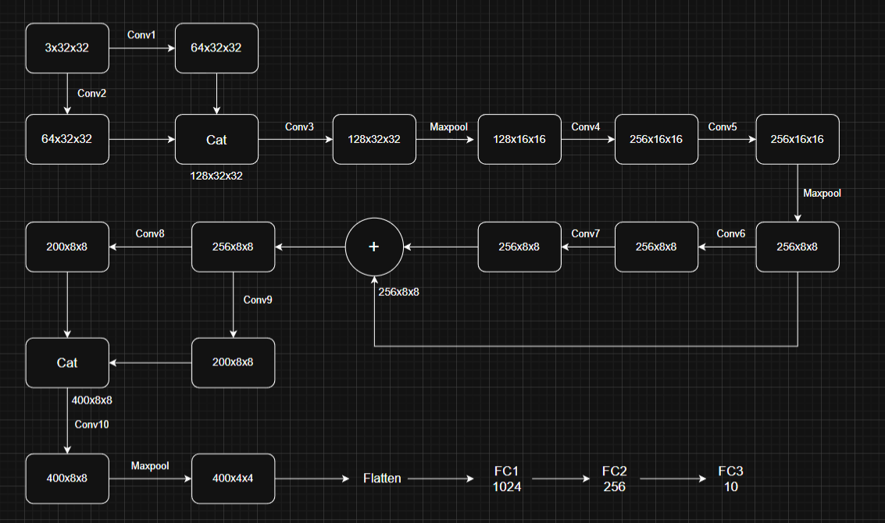
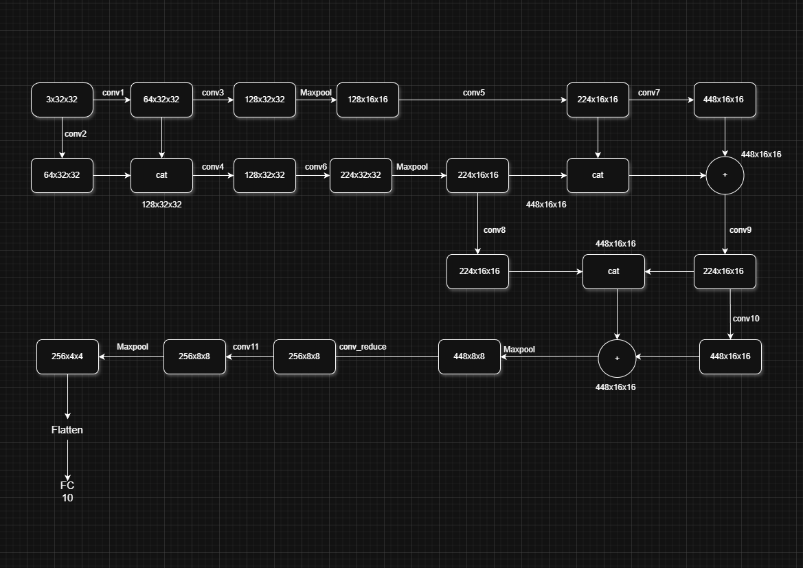
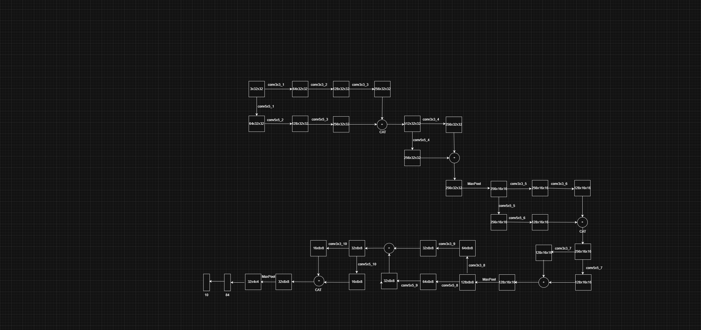

# 🧠 CIFAR-10 Advanced CNN Architectures  
**Machine Learning – Final Group Project**


---

## 📖 Overview

This repository contains our **final group project** for the *Machine Learning* course.  
The project focuses on **image classification using the CIFAR-10 dataset**, implemented and trained with **PyTorch**.

We design, implement, and evaluate **three distinct Convolutional Neural Network (CNN) architectures**, each following **strict architectural constraints** defined by the assignment.

The models demonstrate key deep learning concepts such as:
- Deep convolutional feature extraction  
- Feature concatenation using `torch.cat` (Inception-style)  
- Residual-style tensor addition  
- The impact of different kernel sizes (3×3 vs 5×5)  
- Parameter count control and architectural complexity  

---

## 📂 Directory
```
├──In this repository:
    ├── data
    ├── code
    ├── images
    ├── notebooks
    └── README.md
```
---

## 🏗️ Model Specifications

The project requires the implementation of **three specific CNN architectures** with the following constraints:

| Feature | Model 1 | Model 2 | Model 3 |
|-------|--------|--------|--------|
| **Convolution Layers** | Min 10 × Conv3×3 | Min 10 × Conv5×5 | Min 10 × Conv3×3 + Min 10 × Conv5×5 |
| **Pooling Layers** | 3 × MaxPooling | 2 × MaxPooling | 3 × MaxPooling |
| **Concatenation (`torch.cat`)** | 2 times | 3 times | 3 times |
| **Tensor Addition** | 1 time (add 2 tensors) | 2 times (add 2 tensors) | 3 times (add 2 tensors) |
| **Fully Connected Layers** | 3 layers | Only 1 layer | Exactly 2 layers |
| **Parameter Count** | 5M – 10M | 10M – 20M | 10M – 20M |

---

### 📌 Notes

- `Conv3×3` refers to convolution with `kernel_size = 3`
- `Conv5×5` refers to convolution with `kernel_size = 5`

---

## 🏋️ Training Requirements

- Train **each model for at least 10 epochs** (maximum 50 epochs)
- Use **default hyperparameters** provided in:
  ```
  cifar10_tutorial.ipynb
  ```
- Evaluation must include:
  - Overall classification accuracy  
  - Per-class accuracy on the CIFAR-10 test set  

---

## 🛠️ Technologies Used

- Python 3.8+  
- PyTorch  
- TorchVision  
- Google Colab / Jupiter notebooks

---
## 🧩 Design Diagram
<p align="center">
  
  <br>
  <em>Figure 1. Architecture of Model 1</em>
</p>

<p align="center">
  
  <br>
  <em>Figure 2. Architecture of Model 2</em>
</p>
<p align="center">
  
  <br>
  <em>Figure 3. Architecture of Model 3</em>
</p>

---

## 📄 Additional Notes

This repository focuses on **architectural design and training results**.  
Detailed implementation, training loops, and evaluation scripts are provided in the corresponding notebooks and source files.
